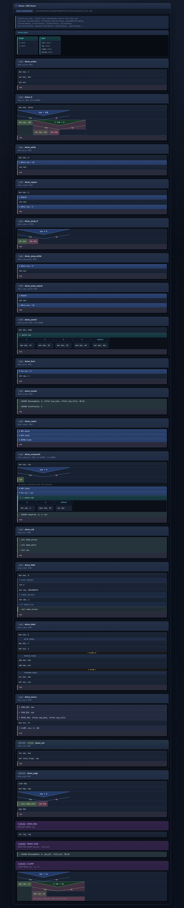

# Masma

Masma is a cleanly layered Python application for parsing MASM source files, producing structural reports, and generating Nassi-Shneiderman diagrams for MASM procedures.

## What the system does

Today the system supports:

* parsing one `.asm` or `.inc` file
* parsing a directory recursively and ignoring non-MASM files
* extracting a stable structural model with includes, constants, variables, segments, structs, macros, procedures, and labels
* reporting syntax diagnostics for unbalanced `PROC/ENDP`, `STRUCT/ENDS`, named `SEGMENT/ENDS`, `MACRO/ENDM`, and structured flow directives
* extracting structured control flow from MASM procedures that use `.IF/.ELSEIF/.ELSE/.ENDIF`, `.WHILE/.ENDW`, `.REPEAT/.UNTIL`, recovered `cmp/je` switch chains, and MASM `loop`-counted loops
* extracting the leading comment header block from a source file and showing it in the diagram
* rendering standalone MASM labels (`name:`) as visual separator markers inside procedure diagrams
* generating HTML Nassi-Shneiderman diagrams for one MASM file or for a directory bundle

## Architecture

The codebase keeps four explicit layers:

* `domain`: invariants, model, ports, and events
* `application`: parse-report and diagram use cases
* `infrastructure`: MASM parser/extractor, filesystem adapters, renderer, logging
* `presentation`: CLI contract

The design stays hexagonal: the application layer depends on parser and rendering ports, not on filesystem or concrete MASM parsing details.

## Quick Start

1. Install dependencies:

```bash
uv sync --extra dev
```

2. Regenerate the ANTLR backend after grammar changes:

```bash
uv run python scripts/generate_masm_parser.py
```

3. Parse one MASM file:

```bash
uv run masma parse-file path/to/program.asm
```

4. Parse a directory:

```bash
uv run masma parse-dir path/to/project
```

5. Build one Nassi-Shneiderman diagram:

```bash
uv run masma nassi-file path/to/program.asm --out output/program.nassi.html
```

6. Build a directory bundle of diagrams:

```bash
uv run masma nassi-dir path/to/project --out output/nassi-bundle
```

## Screenshots

**Nassi-Shneiderman diagram** - all control-flow step types rendered from `feature_tour.asm` (structured directives and recovered jump-based flow):




## Supported MASM Features

Masma currently understands these structural and flow-level MASM constructs:

* `include`, `includelib`
* `EQU`
* `.data`, `.data?`, `.const`, `.code`
* `STRUCT/ENDS`
* `MACRO/ENDM`
* `PROC/ENDP`
* standalone labels (`name:`) rendered as visual separator markers
* leading comment header block extracted and shown at the top of the diagram
* `.IF/.ELSEIF/.ELSE/.ENDIF`
* `.WHILE/.ENDW`
* `.REPEAT/.UNTIL` and `.REPEAT/.UNTILCXZ`
* assembly-time conditionals: `IFDEF`/`IFNDEF`/`IFDIF`/`IFDIFI`/`IFIDN`/`IFIDNI`/`IFB`/`IFNB`/`IF1`/`IF2`/`IF` … `ELSEIF`/`ELSEIFDEF`/`ELSEIFNDEF`/`ELSE`/`ENDIF`
* `;` line comments correctly skipped by the ANTLR lexer (previously comment text leaked into token stream)
* heuristic recovery of common jump-based flow:
  `cmp/test + jcc` for `if`, `cmp/test + jcc + jmp` for `if/else`, label-based `jcc/jmp` loop patterns,
  2+ `cmp reg, val` + `je label` chains for `switch`, `loop label` for ECX-counted loops,
  and direct `call proc` as a highlighted procedure-call step
* an ANTLR-backed structural parser derived from the upstream `grammars-v4` MASM grammar and patched for Masma's working subset

### Control flow step types

The domain and renderer define the following step types. Twelve are fully produced by the MASM extractor; three have no clean structural mapping in MASM assembly.

| Step type | Symbol | Source | Notes |
|---|---|---|---|
| `ActionFlowStep` | *(plain block)* | any instruction | straight-line instructions; `ret`/`retn` highlighted in red |
| `IfFlowStep` | triangle split | structured `.IF/.ELSEIF/.ELSE/.ENDIF`; recovered `cmp/test + jcc` | nested depth shown with circled-number badge ①②… |
| `WhileFlowStep` | ↻ | structured `.WHILE/.ENDW`; recovered top-tested `cmp/jcc + jmp` loop | |
| `RepeatWhileFlowStep` | ↺ | structured `.REPEAT/.UNTIL` / `.REPEAT/.UNTILCXZ`; recovered bottom-tested `jcc` loop | header `↺ Repeat`, footer `↺ UNTIL …` or `↺ While …` |
| `SwitchFlowStep` / `SwitchCaseFlow` | ⎇ | recovered 2+ `cmp reg, val` + `je label` chains with same register | |
| `ForInFlowStep` | ∀ | MASM `loop label` instruction (decrements ECX, jumps if non-zero) | |
| `InvokeFlowStep` | ⇒ | MASM `INVOKE proc, args` macro call | |
| `CallFlowStep` | ⇒ | direct `call proc` (not indirect `call [reg]`) | indirect calls stay as `ActionFlowStep` |
| `MacroCallFlowStep` | ▷ | user-defined `name MACRO …/ENDM` calls detected by scanning source | args shown inline |
| `RepeatStringFlowStep` | ⊛ | `REP`/`REPE`/`REPNE` string instructions; absorbs preceding `mov ecx, n` | `rep movsd`, `repne scasb`, etc. |
| `LabelFlowStep` | — ruler — | standalone `name:` labels not consumed by loop/jump recovery | thin muted separator marker |
| `IfdefFlowStep` | `# IFDEF …` | assembly-time conditionals: `IFDEF`/`IFNDEF`/`IF` (no dot) … `ENDIF` | dashed grey border; body content visible |
| `GuardFlowStep` | — | not applicable | early-exit guard has no clean linear mapping in MASM |
| `DoCatchFlowStep` / `CatchClauseFlow` | — | not applicable | structured exception handling has no natural MASM directive equivalent |
| `DeferFlowStep` | — | not applicable | deferred cleanup has no natural MASM directive equivalent |

## Constraints and honesty

Masma is intentionally honest about scope. It is a MASM source analyzer, not a full assembler or compiler frontend. It does not resolve includes, execute macros, or recover low-level control flow from arbitrary jump graphs. The strongest diagram output comes from MASM code that uses structured directives.

## Testing

Run the test suite with:

```bash
uv run pytest
```

## Next Steps

Useful future extensions:

* richer recovery for raw jump-based control flow
* symbol tables for data/code cross-references
* include graph visualization
* exports to SVG, PNG, or Mermaid
* richer diagnostics for macro parameter contracts and segment usage
